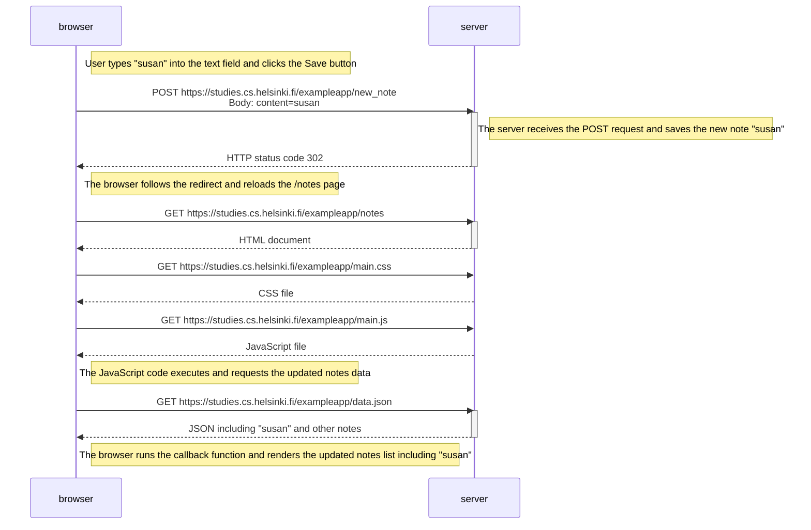

```
sequenceDiagram
    participant browser
    participant server

    Note right of browser: User types "susan" into the text field and clicks the Save button

    browser->>server: POST https://studies.cs.helsinki.fi/exampleapp/new_note<br>Body: content=susan
    activate server
    Note right of server: The server receives the POST request and saves the new note "susan"
    server-->>browser: HTTP status code 302 (HTTP 302 Redirect to /notes)
    deactivate server

    Note right of browser: The browser follows the redirect and reloads the /notes page

    browser->>server: GET https://studies.cs.helsinki.fi/exampleapp/notes
    activate server
    server-->>browser: HTML document
    deactivate server

    browser->>server: GET https://studies.cs.helsinki.fi/exampleapp/main.css
    server-->>browser: CSS file

    browser->>server: GET https://studies.cs.helsinki.fi/exampleapp/main.js
    server-->>browser: JavaScript file

    Note right of browser: The JavaScript code executes and requests the updated notes data

    browser->>server: GET https://studies.cs.helsinki.fi/exampleapp/data.json
    activate server
    server-->>browser: JSON including "susan" and other notes
    deactivate server

    Note right of browser: The browser runs the callback function and renders the updated notes list including "susan"
```



✅ Summary of what happens:
The user types "susan" and clicks Save.  
The browser sends a POST request with "susan" to the server.  
The server saves the note and responds with a 302 redirect to /notes.  
The browser reloads the /notes page, requesting CSS, JS, and updated JSON data.  
The browser then re-renders the notes list, now including "susan".
