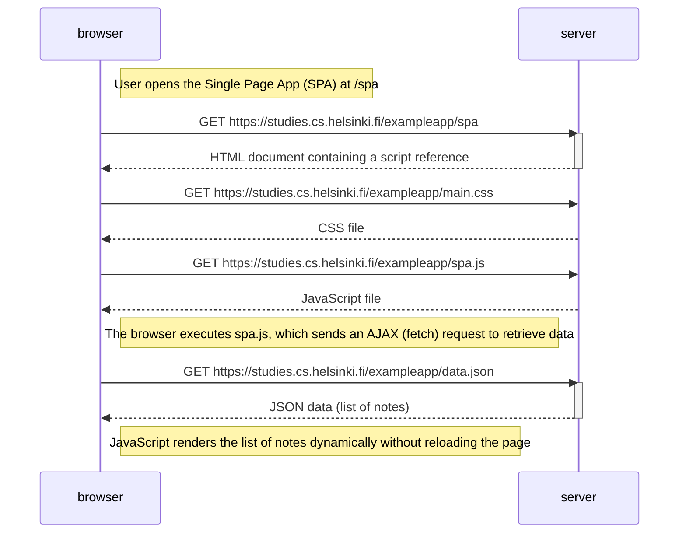

```
sequenceDiagram
    participant browser
    participant server

    Note right of browser: User opens the Single Page App (SPA) at /spa

    browser->>server: GET https://studies.cs.helsinki.fi/exampleapp/spa
    activate server
    server-->>browser: HTML document containing a script reference
    deactivate server

    browser->>server: GET https://studies.cs.helsinki.fi/exampleapp/main.css
    server-->>browser: CSS file

    browser->>server: GET https://studies.cs.helsinki.fi/exampleapp/spa.js
    server-->>browser: JavaScript file

    Note right of browser: The browser executes spa.js, which sends an AJAX (fetch) request to retrieve data

    browser->>server: GET https://studies.cs.helsinki.fi/exampleapp/data.json
    activate server
    server-->>browser: JSON data (list of notes)
    deactivate server

    Note right of browser: JavaScript renders the list of notes dynamically without reloading the page
```




✅ Summary:
The browser requests and loads the /spa HTML file.  
Then it fetches the CSS and JavaScript files.  
The JavaScript (spa.js) runs and sends a fetch (AJAX) request to get note data from /data.json.  
The server responds with the JSON list of notes.  
The browser renders the notes dynamically, without any page reload — that’s what makes it a Single Page Application.
