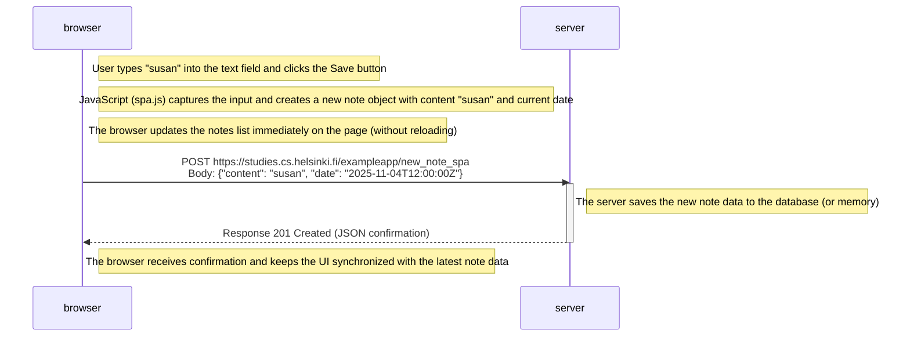

```
sequenceDiagram
    participant browser
    participant server

    Note right of browser: User types "susan" into the text field and clicks the Save button

    Note right of browser: JavaScript (spa.js) captures the input and creates a new note object with content "susan" and current date

    Note right of browser: The browser updates the notes list immediately on the page (without reloading)

    browser->>server: POST https://studies.cs.helsinki.fi/exampleapp/new_note_spa<br>Body: {"content": "susan", "date": "2025-11-04T12:00:00Z"}
    activate server
    Note right of server: The server saves the new note data to the database (or memory)
    server-->>browser: Response 201 Created (JSON confirmation)
    deactivate server

    Note right of browser: The browser receives confirmation and keeps the UI synchronized with the latest note data
```


### ✅ Summary  
The user types "susan" and clicks Save.  
JavaScript (spa.js) handles the onclick event and creates a new object { content, date }.  
The browser sends a POST request to /new_note_spa.  
The server saves the data and returns a JSON response (no redirect, unlike the old version).  
The browser does not reload the page — it simply updates the notes list in the user interface.  


### ✅ Key Differences
| Feature             | `/notes` (Traditional)                  | `/spa` (Single Page App) |
| ------------------- | --------------------------------------- | ------------------------ |
| **Page reload**     | Yes (full reload after POST + redirect) | No reload (AJAX / fetch) |
| **Request type**    | `POST → 302 Redirect → GET`             | `POST → JSON response`   |
| **Data exchange**   | HTML + JSON + CSS + JS                  | JSON only                |
| **UI update**       | After reloading the page                | Instantly via JavaScript |
| **User experience** | Slower, reloads page                    | Faster, smoother         |

